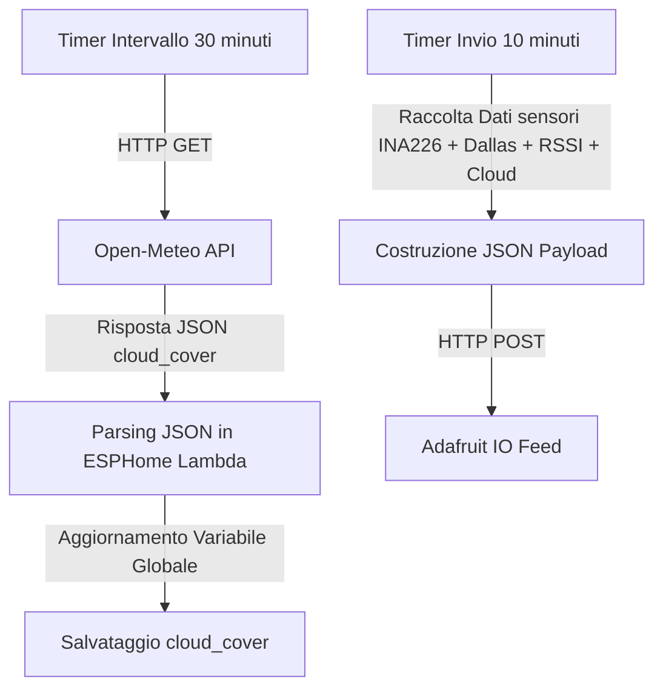

# Piano di Integrazione Dato Nuvolosità in ESPHome

## 1. Scelta dell'API Meteo Gratuita
Per ottenere il dato di nuvolosità in modo semplice e totalmente gratuito senza necessità di registrazione o chiavi API (API Key), utilizzeremo **Open-Meteo API**.
- **Endpoint URL**: `https://api.open-meteo.com/v1/forecast?latitude=45.4642&longitude=9.1900&current=cloud_cover` (con coordinate configurabili tramite substitution o secrets).
- **Formato Risposta**: JSON contenente `current.cloud_cover` (espresso in percentuale da 0 a 100%).
- **Conversione**: Il valore percentuale (0-100%) può essere convertito in un coefficiente da 0 a 1 (`cloud_cover / 100.0f`) o in un punteggio da 0 a 10 (`cloud_cover / 10.0f`). Nel payload JSON useremo ad esempio `cloud` o `cloud_cover`.

## 2. Architettura in ESPHome (`solar-monitor-box.yaml`)

1. **Substitutions / Secrets**:
   - Aggiungere `latitude` e `longitude` (o coordinate di default) nelle substitutions o in `secrets.yaml`.
2. **Variabile Globale**:
   - Definire una variabile globale `float cloud_cover` per memorizzare l'ultimo valore valido di nuvolosità.
3. **Componente HTTP Request & Intervallo di Aggiornamento**:
   - Sfruttare `http_request` già presente nel file.
   - Configurare un `interval` dedicato (es. ogni 30 minuti) per effettuare una richiesta HTTP GET a Open-Meteo.
   - Nel blocco `then`, eseguire il parsing della risposta JSON utilizzando `ArduinoJson` (già integrato in ESPHome) per estrarre `current.cloud_cover`.
4. **Invio ad Adafruit IO**:
   - Inserire il campo `cloud` (o `cloud_cover`) nel JSON inviato tramite `send_to_adafruit`.

## 3. Diagramma di Flusso (Mermaid)

## 4. Dettagli di Implementazione Codice
- Aggiunta substitutions coordinate.
- Aggiunta globale `globals`.
- Script o blocco `interval` per richiesta meteo.
- Aggiornamento di `json_buffer` in `send_to_adafruit` per includere `"cloud":%.2f`.
